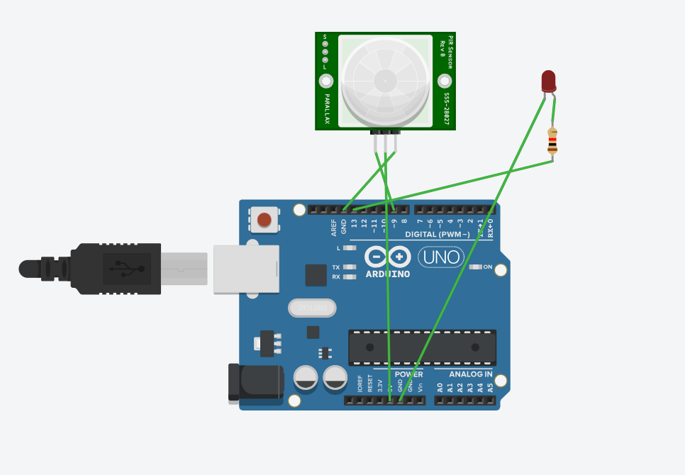

# pir-motion-detector
Motion detection using PIR sensor with Arduino and Tinkercad
# PIR Motion Detection using Arduino

## Description

This project demonstrates how to use a PIR (Passive Infrared) sensor with Arduino to detect motion. When motion is detected, an LED turns ON automatically.

## Components Used

* Arduino Uno
* PIR Sensor
* LED
* Resistor
* Jumper wires

## Working

The PIR sensor detects infrared radiation from moving objects (like humans). When motion is detected, it sends a HIGH signal to the Arduino, which turns ON the LED. When no motion is detected, the LED remains OFF.

## Circuit Diagram

## Code

The code is available here: [pir.ino](pir.ino)

## Applications

* Security systems
* Automatic lighting
* Motion detection alarms

## Author

HimagnaMovva27
